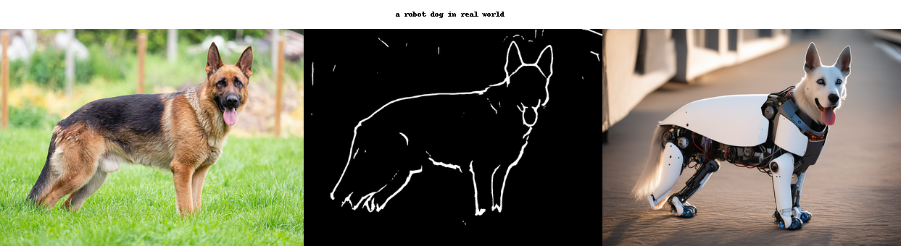
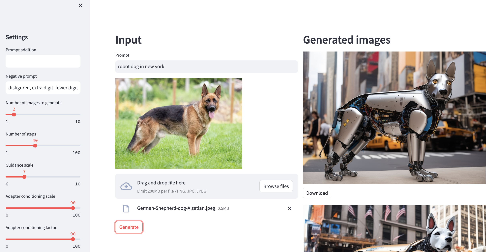
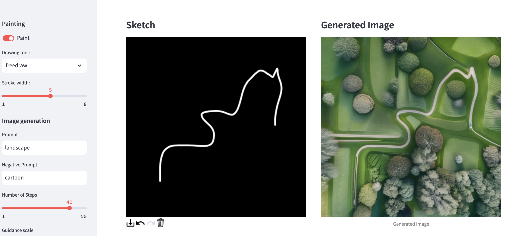
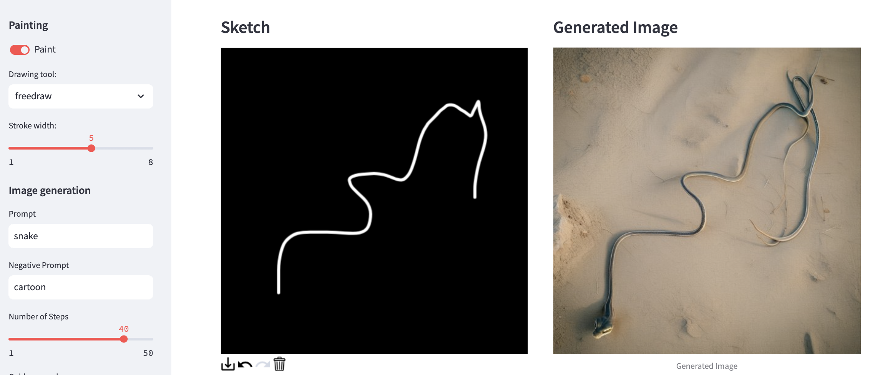
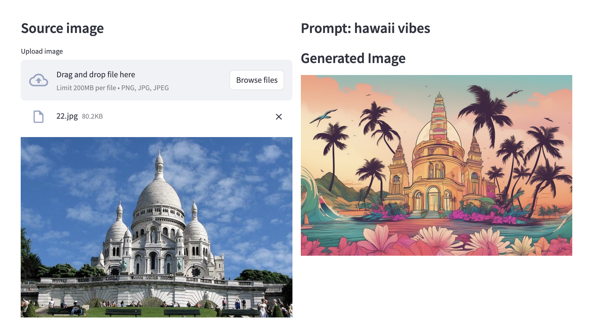

# Minimal working examples of T2I-Adapters for Stable Diffusion XL (SDXL)

## Gallery

### img2sketch2img

skribble2img

### img2canny2img

## Code

- notebooks and minimalistic streamlit apps

